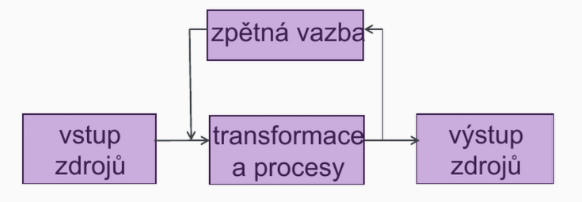
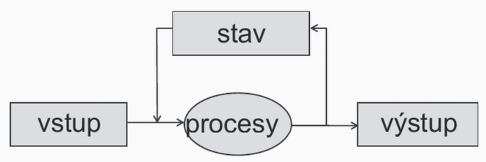
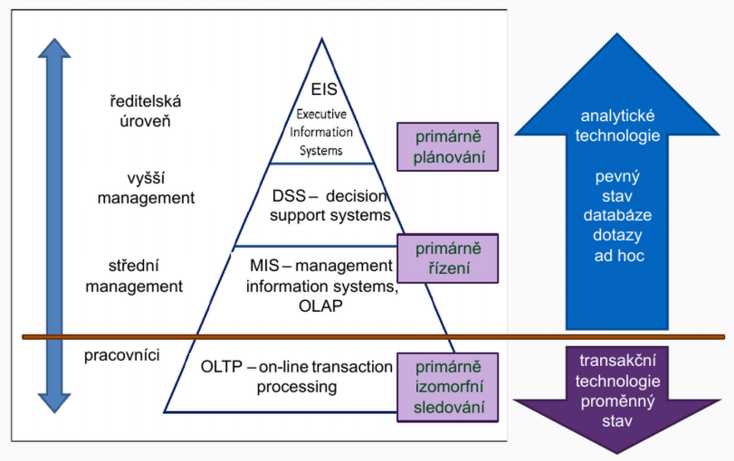

## Pojem informačního systému, data, informace

[toc]

---

### Pojem informace

- Energetická veličina, jejíž hodnota je úměrná _zmenšení entropie_ systému
- Poznatek, který omezuje nebo _odstraňuje nejistotu_ týkající se výskytu určitého jevu
- Teorie informace – Claude Shannon
  - $H = - \sum p_i \log_2 p_i$
  - $I = H(\text{výchozí stav}) - H(\text{nový stav})$
- Z hlediska IT – interpretované rozhodnutí mezi dvěma alternativami (0, 1), jednotka _bit_

### Data – informace – znalosti

#### Data

- Hodnota schopná přenosu, uchování, interpretace či zpracování
- Sama o sobě _nemají sémantiku_ (význam)
- Hodnoty dat obvykle udávají stav nějakého systému

#### Informace

- Interpretovaná data
- Mají sémantiku (význam)
- Transformaci dat na informace neprovádí IS, ale _uživatel_
- Je nezbytné zajistit shodnou interpretaci dat u všech uživatelů informace (vzdělání, školení, konvence)

#### Znalost

- Informace zařazená do souvislostí

### Systém

- **Množina prvků a vazeb mezi nimi**, které jsou definovány na nějakém nosiči
- Nosič – _množina prvků systému_ ve vzájemných vztazích, prvky nosiče nazýváme _zdroje_
- Typické nosiče:
  - Fyzické (materiální): osoby (HR), materiál, stroje včetně zařízení a energie, finance
  - Konceptuální (pojmové): informace

#### Obecné schéma systému

- Zpětná vazba může reprezentovat _stav systému_ (sekvenční systémy), výstup pak záleží na vstupu a stavu systému
- Stavem systému jsou _hodnoty zdrojů_

#### Dělení systémů podle typu nosiče

- Fyzické – s nosičem s fyzickými zdroji (např. obchodní firma)
- Informační – s nosičem s konceptuálními zdroji, tedy informacemi
- Informační systém obvykle modeluje nějaký fyzický systém

### Informační systém

- _Otevřený_ systém, jehož nosič používá **konceptuální zdroje** – informace
- Nakládá s _nehmotnými_ zdroji
- Nakládáním rozumíme provádění různých **transformací nad stavem** na základě vstupu a poskytování výstupu
- Stavem IS jsou _hodnoty dat_ (typicky reprezentované pomocí nějakého modelu) a musíme se zabývat jejich _perzistencí_ a _konzistencí_

#### Schéma informačního systému

- Modifikované schéma obecného systému
- Data uchovávající _stav_ systému
- _Procesy_ realizující transformace často ve formě transakcí

#### Informační systém jako model

- Informace _modelují skutečné zdroje jiného_, obvykle fyzického systému (např. podniku)
- IS na nehmotné úrovni modeluje svůj fyzický vzor, kopie má vhodnou úroveň abstrakce
- Návrh informačního systému:
  - S jakými daty pracujeme?
  - Jaké jsou k dispozici vstupy?
  - Jak je třeba data transformovat?
  - Jak mají vypadat výstupy?

### Klasifikace informačních systémů

#### Podle podobnosti nosičů

- Existuje více podobných modelovaných fyzických nosičů, tj. existují podobné IS → typové projekty:
  - geografie a zeměměřičství,
  - knihovna,
  - účetnictví,
  - banka, pokladny a platby,
  - mzdy a správa lidských zdrojů,
  - majetek a odpisy,
  - pacienti a styk se ZP,…
  - Takto členěné typové projekty bývají často i předmětem odděleného prodeje ve formě modulů

#### Podle režimu činnosti

- Zpracování požadavků v reálném čase:
  - Transakční zpracování – dnes nejobvyklejší (rezervace letenek, knihovna, platba kartami)
  - Technologické procesy (řízení výroby, diagnostika)
- Dávkové zpracování dat – nyní spíše ustupuje (tradičně střediskové počítače, bankovní sektor)

#### Podle datového typu dat

- Číselné a textové (většina ekonomických i technologických IS)
- Speciální údaje (např. geografické IS)

#### Podle úrovně rozhodování

- Klasické _pyramidové schéma_
- Odráží hierarchii úrovně rozhodování v organizaci:
  - Systém pro zpracování transakcí
  - Management information systems
  - Decision support systems
  - Executive information systems

##### OLTP – Online Transaction Processing

- Třída IS, které zpracovávají **transakčně orientované aplikace**
- Termín transakční je dvojznačný – _databázové transakce_ a _komerční (business) transakce_

##### MIS – Management Information Systems

- _Informační systémy pro podporu řízení_
- Poskytují informace, které jsou potřebné pro efektivní **řízení organizace**
- **Povoleno zpoždění** – nemusejí nutně pracovat nad aktuálním modelem fyzického systému
- Nejčastěji jde o:
  - Systémy pro podporu rozhodování (DSS)
  - Expertní systémy (ES)
  - Informační systémy pro exekutivu (EIS)
  - OLAP (Online Analytical Processing)
