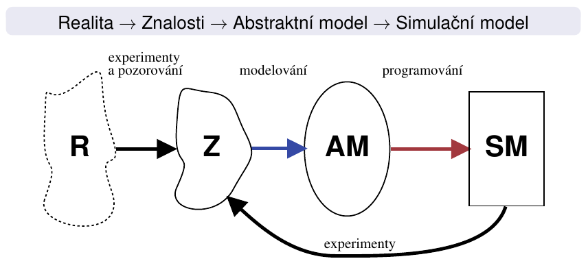
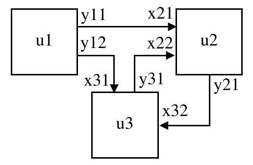
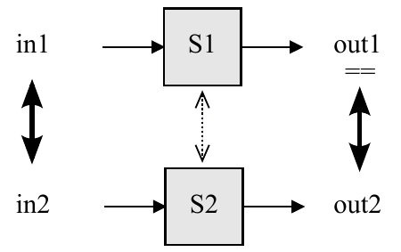
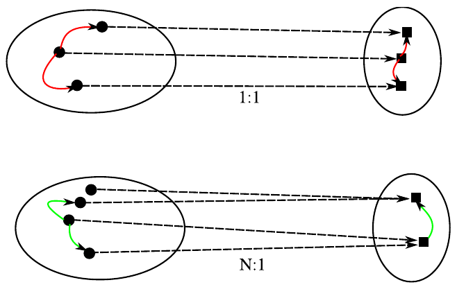
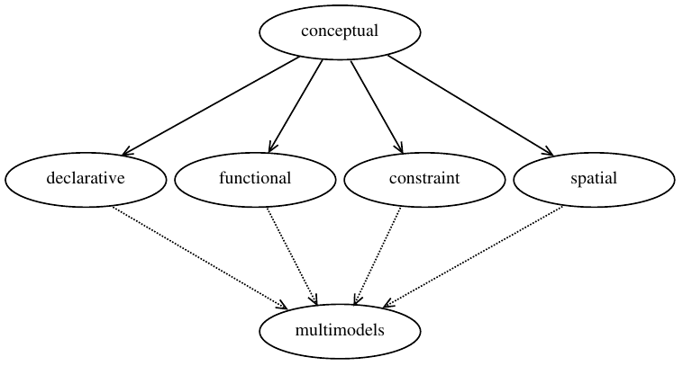
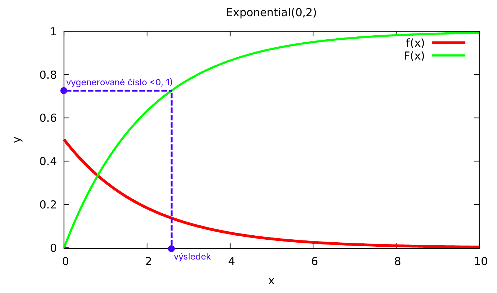

# Modelování a simulace

[toc]

---

## Úvod (přednáška 1)

### Základní pojmy

#### Systém

- Soubor elementárních částí (_prvků systému_), které mají mezi sebou určité vazby
- Reálné/nereálné (fiktivní, ještě neexistující) systémy
- Statické/dynamické systémy – nemění/mění svůj stav v čase

#### Model

- Napodobenina systému jiným systémem (model je také systém), reprezentace znalostí
- Klasifikace: fyzikální modely, matematické modely,…
- Přírodní zákony jsou matematické modely (např. Ohmův zákon)

#### Modelování

- Vytváření modelů systému
- Modelovat lze jen to, co známe a umíme popsat
- Simulační model – takový model, s kterým je možné provádět experimenty

#### Simulace

- Metoda získávání nových znalostí o systému experimentováním s jeho modelem
- Cílem je získávání nových znalostí o vzorovém systému



- Modrá šipka – zjednoduší a zahodí nepotřebné
- Červená šipka – přepíše abstraktní model 1:1 do programu

#### Abstraktní model (AM)

- Znalostní, matematický model, zatím nelze použít pro experimenty
- Nemusí zahrnovat všechny znalosti, jenom ty důležité pro řešení problému

#### Simulační model (SM)

- Implementace abstraktního modelu programem, s kterým se dají provádět experimenty

### Etapy modelování a simulace

1. Vytvoření abstraktního modelu – formování zjednodušeného popisu zkoumaného systému
2. Vtvoření simulačního modelu – zápis abstraktního modelu formou programu
3. Verifikace a validace – ověřování správnosti modelu<br>
   Verifikace = Odpovídá program specifikaci? = Odpovídá simulační model abstraktnímu?<br>
   Validace = Je model jako celek správně? Dává relevantní výsledky? Odpovídá realitě?
4. Simulace – experimentování se simulačním modelem
5. Analýza a interpretace výsledků – získání nových znalostí o zkoumaném systému

### Výhody simulačních metod

- Cena (např. crash testy automobilů)
- Rychlost (růst rostlin, vznik krystalů, pohyb planet)
- Bezpečnost (jaderné reakce, šíření epidemií)
- Někdy jediný způsob (srážky galaxií)
- Možnost modelovat velmi složité systémy (mikroprocesory, různé biologické systémy, počasí)
- **Velmi často je výhodnější experimentovat s modely, než s originálními systémy**

### Problémy simulačních metod

- Problém validity (platnosti) modelu
- Někdy velmi vysoká náročnost vytváření modelů
- Náročnost na výkon počítačů
- Získáváme konkrétní numerické výsledky (např. změna parametru vyžaduje opakování celé simulace)
  - Analytické řešení je lepší – dosadit a hotovo
- Nepřesnost numerického řešení
- Problém stability numerických metod (divergence místo konvergence)

### Alternativa – analytické řešení modelu

- Popis chování systému matematickými vztahy a jeho _matematické řešení_
- Vhodné pro jednoduché systémy nebo zjednodušené popisy složitých systémů
- Výsledky jsou ve formě funkčních vztahů, ve kterých se jako proměnné vyskytují parametry modelu
- Dosazením konkrétních hodnot získáme řešení
- **Shrnutí: přesnost a menší časová náročnost výpočtu řešení matematického modelu, řešit ale umíme jen modely jednoduché nebo podstatně zjednodušené**
- Např. model volného pádu ve vakuu

### Kdy použít simulační modely

- Neexistuje úplná matematická formulace problému nebo nejsou známé analytické metody řešení mat. modelu
- Analytické metody vyžadují tak zjednodušující předpoklady, že je nelze pro daný model přijmout
- Analytické metody jsou dostupné jen teoreticky, jejich použití by bylo obtížné a simulační řešení je jednodušší
- Modelování na počítači je jedinou možností získání výsledků v důsledku obtížnosti provádění experimentů ve skutečném prostředí
- Potřebujeme měnit časové měřítko (simulace např. umožní vypočítat řešení rychleji než by příslušný děj proběhl v reálném systému)

### Úvod do teorie systémů

#### Formální definice systému

Systém $S$ je dvojice $S = (U, R)$, kde:

- Univerzum $U$ je konečná množina prvků systému, $U = \{u_1, u_2, \dots, u_N\}$
- Prvek systému je dvojice $u = (X, Y)$, kde:
  - $X$ je množina všech vstupních proměnných
  - $Y$ je množina všech výstupních proměnných
- Charakteristika systému $R$ je množina všech propojení
  $$R = \bigcup_{i, j = 1}^N R_{ij}$$
- Propojení prvku $u_i$ s prvkem $u_j$: $R_{ij} \subseteq Y_i \times X_j$



$U = \{u_1, u_2, u_3\}$

$R = \{(y_{11}, x_{21}), (y_{12}, x_{31}), (y_{31}, x_{22}), (y_{21}, x_{32})\}$

#### Čas

- **Reálný čas**, ve kterém probíhá skutečný děj v reálném systému (fyzikální definice času)
- **Modelový čas** je „časová osa“ modelu, modeluje reálný čas ze vzorového systému, při simulaci nemusí být synchronní s reálným časem
- **Strojový čas** je čas CPU spotřebovaný na výpočet programu, závisí na složitosti simulačního modelu

#### Časová množina

- Časová množina (_time base_) $T$ je množina všech časových okamžiků, ve kterých jsou definovány hodnoty vstupních, stavových a výstupních proměnných prvku systému
- Diskrétní: $T_d = \{1, 2, 3, 4, 5\}$
- Spojitá: $T_s = \left< 1.0, 5.0 \right> \quad T_s \subset \R$
- Na číslicovém počítači se spojitá časová množina vždy diskretizuje

#### Chování systému

- Každému časovému průběhu vstupních proměnných přiřazuje časový průběh výstupních proměnných
- Je dáno vzájemnými interakcemi mezi prvky systému
- Zobrazení $\chi: [\sigma_i(S)]^T \rightarrow [\sigma_o(S)]^T$, kde:
  - $[A]^T$ je množina všech zobrazení $T$ do množiny $A$
  - $\sigma_i(S)$ je vstupním prostorem systému $S$
  - $\sigma_o(S)$ je výstupním prostorem systému $S$

#### Ekvivalence chování systémů

- Systémy $S_1$ a $S_2$ považujeme za systémy se stejným chováním, vyvolají-li stejné podněty u obou systémů stejné reakce
- Stejnými podněty/reakcemi rozumíme ty dvojice podnětů/reakcí, které jsou spolu vzájemně přiřazeny definovaným vstupním/výstupním zobrazením



#### Izomorfní systémy

- „Shoda systémů až na značení“ (1:1)
- Abstraktní model → simulační model

#### Homomorfní systémy

- „Zjednodušení“ (N:1)
- Znalosti → abstraktní model



#### Okolí systému

- Podstatné okolí systému zahrnuje vše, co má vliv na chování systému a není jeho součástí
- **Uzavřený systém** – nekomunikuje s okolím (často jen zanedbáváme vliv okolí)
- **Otevřený systém** – komunikuje s okolím (typicky má definován vstup i výstup)

#### Klasifikace prvků systémů

- Prvky se spojitým chováním, s diskrétním chováním
- Prvky s deterministickým chováním, s nedeterministickým chováním
- Např.:
  - šumová dioda = spojitý prvek, stochastické chování
  - rezistor = spojitý prvek, deterministické chování
  - FIFO fronta = diskrétní prvek, deterministické chování

#### Klasifikace systémů

- **Typ systému závisí na typech jeho prvků**
- Spojité – všechny prvky mají spojité chování
- Diskrétní – všechny prvky mají diskrétní chování
- Kombinované – obsahuje spojité i diskrétní prvky
- Deterministické – všechny prvky deterministické
- Nedeterministické – alespoň jeden prvek s nedeterministickým chováním

### Typy simulace

- Spojitá/diskrétní/kombinovaná
- Kvalitativní/kvantitativní
- Na analogovém/číslicovém počítači, fyzikální
- „Real-time“ simulace
- Paralelní a distribuovaná simulace
- Vnořená simulace (simulace v simulaci)
- „Reality in the loop“
- Interaktivní simulace, virtuální realita

## Modely a modelování (přednáška 2)

- Příklady abstraktních modelů:
  - Konečný automat
  - Petriho síť
  - Turingův stroj
  - Algebraické rovnice
  - Diferenciální rovnice (obyčejné i parciální)
  - Diferenční rovnice
  - Markovské procesy

### Verifikace modelu

- Ověření korespondence abstraktního a simulačního modelu, tj. izomorfní vztah mezi AM a SM
- Odpovídá program (SM) specifikaci (AM)? Nedošlo k chybám při programování?
- Předchází etapě simulace
- Analogicky s programy v běžných programovacích jazycích představuje verifikace SM jejich ladění
- Abstraktní model je formální specifikací pro program (simulační model)

### Validace modelu

- Proces, při němž se snažíme dokázat, že skutečně pracujeme s modelem adekvátním modelovanému systému
- Jeden z nejobtížnějších problémů modelování
- Vyžaduje neustálou konfrontaci informací, které o modelovaném systému máme a které simulací získáváme
- Nelze absolutně dokázat přesnost modelu (validitu modelu chápeme jako míru použitelnosti/správnosti získaných výsledků)
- Pokud chování modelu neodpovídá předpokládanému chování originálu, musíme model modifikovat

### Klasifikace modelů

- Konceptuální modely
- Deklarativní modely
- Funkcionální modely
- Modely popsané rovnicemi (_constraint_)
- Prostorové (_spatial_) modely
- Multimodely – složeny z modelů různého typu



#### Konceptuální modely

- Modely, jejichž komponenty (prozatím) **nebyly přesně popsány** ve smyslu teorie systémů
- Obvykle se používají v počáteční fázi modelování pro ujasnění souvislostí a komunikaci v týmu
- Mají formu textu nebo obrázků

#### Deklarativní modely

- **Popis přechodů mezi stavy systému**
- Model je definován _stavy a událostmi_, které způsobí přechod z jednoho stavu do druhého za jistých podmínek
- Vhodné především pro diskrétní modely
- Obvykle zapouzdřeny do objektů (hierarchická struktura)
- Konečné automaty, Petriho sítě, událostmi řízené systémy s kalendářem

#### Funkcionální modely

- **Grafy zobrazující _funkce a proměnné_**
- Jsou možné 2 modifikace: uzel grafu je funkce nebo proměnná
- Systémy hromadné obsluhy (_queuing systems_) se zařízeními a frontami, bloková schémata, kompartmentové systémy, grafy signálových toků, systémová dynamika

#### Modely popsané rovnicemi

- **Rovnice (algebraické, diferenciální, diferenční)**
- Neorientované grafy (elektrická schémata, „bond-graphs“)
- Např. diferenciální rovnice systému dravec-kořist:
  $$\frac{\textrm{d}x_k}{\textrm{d}t} = k_1 x_k - k_2 x_k x_d$$
  $$\text{(přírůstek kořistí} - \text{úbytek kořistí)}$$
  $$\frac{\textrm{d}x_d}{\textrm{d}t} = k_2 x_k x_d - k_3 x_d$$
  $$\text{(přírůstek dravců} - \text{úbytek dravců)}$$
- Balistika, kyvadlo, RC článek, chaos („Lorenz equation“), logistická rovnice

#### Prostorové (_spatial_) modely

- **Rozdělují systém na prostorově menší ohraničené podsystémy**
- Parciální diferenciální rovnice (difuze, proudění), celulární automaty, L-systémy, _N-body problem_

#### Multimodely

- Modely složené z různých typů modelů, které jsou obvykle heterogenní (popsané různým způsobem)
- Kombinované modely (spojité + diskrétní), modely s neurčitostí (např. spojité + fuzzy), modely na různé úrovni abstrakce (kvalitativní + kvantitativní), spojování modelů (FMI, „co-simulation“, HLA,…)

## Modelování náhodných procesů (přednáška 3)

- Některé části reality neumíme/nechceme popsat jinak → používáme náhodné jevy/procesy
- Např. hod kostkou – není nevysvětlitelný, ale neumíme/nechceme modelovat → prohlásíme za náhodu

### Náhodné proměnné

- Náhodná proměnná je taková veličina, která jako výsledek pokusů může nabýt něajkou hodnotu, přičemž předem nevíme, jakou konkrétně
- Diskrétní – nabývají jen konečně nebo spočetně mnoha různých hodnot
- Spojité – hodnoty spojitě vyplňují určitý interval

### Diskrétní rozdělení pravděpodobnosti

- Pravděpodobnostní funkce $p(x)$, distribuční funkce $F(x)$

<center>

| $x_i$ | $x_1$ | $x_2$ | $\dots$ | $x_N$ |
| ----- | ----- | ----- | ------- | ----- |
| $p_i$ | $p_1$ | $p_2$ | $\dots$ | $p_N$ |

</center>

$$p_i = P(X = x_i) \qquad \sum_{i = 1}^N p_i = 1$$
$$F(x) = P(X \leq x) = \sum_{x_i \leq x} p_i$$

- Poissonovo rozdělení – počet událostí za jednotku času

### Spojitá rozdělení pravděpodobnosti

- Hustota pravděpodobnosti $f(x)$, distribuční funkce $F(x)$

$$f(x) \geq 0 \qquad f(x) = \frac{\mathrm{d}F(x)}{\mathrm{d}x} \qquad \int_{-\infty}^{\infty} f(x)\ \textrm{d}x = 1$$
$$P(a \leq X \leq b) = \int_a^b f(x)\ \mathrm{d}x = F(b) - F(a)$$

- Rovnoměrné rozdělení – všechny hodnoty s podobnou četností
- Exponenciální rozdělení – časy příchodů
- Normální rozdělení – typické pro procesy v přírodě
  - Pravidlo tří sigma: $P(X \in \left< \mu - 3\sigma, \mu + 3\sigma \right>) \geq 0.99$
- Pearsonovo rozdělení $\chi_k^2$ – testování statistických hypotéz

### Generování pseudonáhodných čísel

- Základem je kvalitní generátor rovnoměrného rozložení
- Jeho transformací získáme soubor čísel jiného rozložení

#### Kongruentní generátory

- Komponenta, která má **vnitřní stav**, s novým číslem přejde do nového stavu ($x_n \rightarrow x_{n + 1}$)

$$x_{n + 1} = (ax_n + b)\ \mathrm{mod}\ m$$

- Konstantní parametry $a$, $b$ a $m$ (multiplikační, aditivní, modul) musí mít vhodné hodnoty
- Generují **rovnoměrné rozložení** $\left< 0, m \right)$
- Rozsah $\left< 0, m \right)$ se převádí na normovaný $\left< 0, 1 \right)$
- Generují periodicky se opakující posloupnost čísel, _perioda generátoru_ je max. $m$ a závisí na parametrech
- Dvě po sobě generovaná čísla nejsou statisticky nezávislá
- Aditivní konstanta existuje proto, aby generátor neuvízl v nule ($a \cdot 0 = 0$)
- (Modulo vyjadřuje pouze přetečení registru)

```cpp
class Congr {
    // Stav generatoru – integer!
    unsigned ix;

public:
    Congr(unsigned seed = SEED) : ix{seed} {}

    unsigned next() {
        ix = A * ix + B; // Modulo implicitne
        return ix;
    }

    double next_double() {
        // Mapovani na rozsah <0,1)
        return next() / (UINT_MAX + 1.0);
    }
}
```

#### Jiné metody generování

- Mersenne Twister (perioda $2^{19937} - 1$)
- Xorshift
- Různé další varianty LCG (Linear Congruential Generator)
- Bitové operace, carry – LFSR (Linear Feedback Shift Register)
- Požadavky na generátory: rovnoměrnost rozložení, statistická nezávislost generované posloupnosti, co nejdelší perioda, rychlost

#### Transformace na jiná rozložení

- Metoda inverzní transformace – používá inverzní distribuční funkci cílového rozložení
- Vylučovací metoda – sérií pokusů hledá číslo, které vyhovuje funkci hustoty cílového rozložení
- Kompoziční metoda – složitou funkci hustoty rozložíme na několik jednodušších (intervaly, na každý z nich lze použít jinou metodu)
- Jiné metody, specificky vytvořené pro dané rozložení

##### Metoda inverzní transformace

1. Inverze distribuční funkce: $F^{-1}$
2. Generování $x = \text{Uniform}(0, 1)$
3. Výsledek $y = F^{-1}(x)$



##### Vylučovací metoda

- Generování náhodné veličiny $\xi$ s funkcí hustoty $f(x)$, kde:
  - $x \in \left< x_1, x_2 \right)$
  - $f(x) \in \left< 0, M \right)$, $M$ je maximální hodnota $f(x)$

1. $x = \text{Uniform}(x_1, x_2)$
2. $y = \text{Uniform}(0, M)$
3. Je-li $y < f(x)$, pak $x$ prohlásíme za hodnotu náhodné veličiny $\xi$, jinak goto 1

- Nehodí se na neomezená rozložení

### Metoda Monte Carlo

- Experimentální numerická (simulační) metoda (metody)
- Řeší danou úlohu experimentováním se stochastickým modelem
- Využívá vzájemného vztahu mezi hledanými veličinami a pravděpodobnostmi, se kterými nastanou určité jevy
- Vyžaduje generování (pseudo)náhodných čísel
- Není příliš přesná
- Existuje řada variant (_Metropolis_, _Quasi-MC_)
- Historie: Buffonova úloha, projekt _Manhattan_
- Aplikace: výpočet určitých integrálů, řešení diferenciálních rovnic, finance

1. Vytvoříme stochastický model
2. Provádíme náhodné experimenty
3. Získanou pravděpobodnost nebo průměr použijeme pro výpočet výsledku

## Diskrétní simulace (přednáška 4)

### Procesy

- Proces je **posloupnost událostí**
- Paralelní procesy – současně prováděné procesy
- Kvaziparalelismus – provádění „paralelních“ procesů na jednoprocesorovém počítači
- V modelovaných systémech často existuje mnoho paralelně probíhajících a vzájemně komunikujících procesů

### P/T Petriho sítě

$$\Sigma = (P, T, F, W, C, M_0)$$

- $P$ je množina míst
- $T$ je množina přechodů, $P \cap T = \emptyset$
- $F \subseteq (P \times T) \cup (T \times P)$ je incidenční relace
- $W: F \rightarrow \{ 1, 2, \dots \}$ je váhová funkce
- $C: P \rightarrow \N$ jsou kapacity míst
- $M_0: P \rightarrow \N$ je počáteční značení

### Systémy hromadné obsluhy (SHO)

- Systémy hromadné obsluhy (_queueing systems_) jsou systémy obsahující zařízení (s frontami), která poskytují obsluhu transakcím
- Typický SHO obsahuje:
  - transakce (=procesy) a popis jejich příchodů
  - obslužné linky (více typů) a popis obsluhy
  - fronty různých typů, ve kterých transakce čekají

#### Vstupní tok požadavků

- Stochastický proces příchodů do systému
- Střední doba mezi příchody (exponenciální rozložení)
- Počet příchodů za jednotku času (Poissonovo rozložení)

#### Fronty čekajících požadavků

- Vytvoří se vždy, když požadavek chce být obsloužen již obsazeným zařízením
- Frontové řády – FIFO, LIFO, SIRO (_Service in Random Order_)
- Nulová fronta – požadavek nemůže vstoupit do fronty, jde o systém se ztrátami
- Fronta konečná – omezení kapacity fronty
- Fronta s netrpělivými požadavky – netrpělivý požadavek opouští systém po timeoutu

#### Prioritní fronty, priorita obsluhy

- Přicházející požadavky nejsou rovnocenné – požadavek na obsluhu může mít zvláštní prioritu
- Prioritních úrovní může být více
- U jedné obslužné linky lze vytvářet více front s různými prioritami

#### Kendallova klasifikace SHO

- Standard stručného a přehledného vyjádření typu SHO – **X**/**Y**/**c**, kde:
  - **X** – typ stochastického procesu popisujícího příchod požadavků k obsluze
  - **Y** – zákon rozložení délky obsluhy
  - **c** – počet dostupných obslužných linek
- M = exponenciální rozložení, D = konstantní doba,…
- Např. systém M/M/1 – příchod požadavků v intervalech daných exponenciálním rozložením, doba obsluhy daná exponenciálním rozložením, jedna obslužná linka
