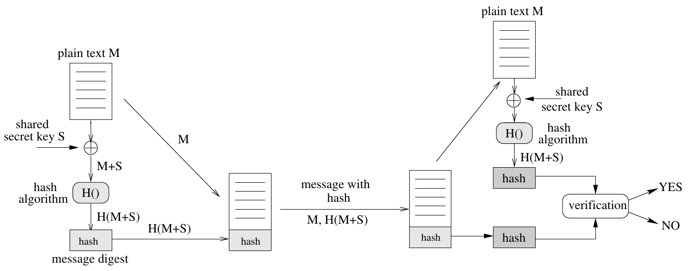
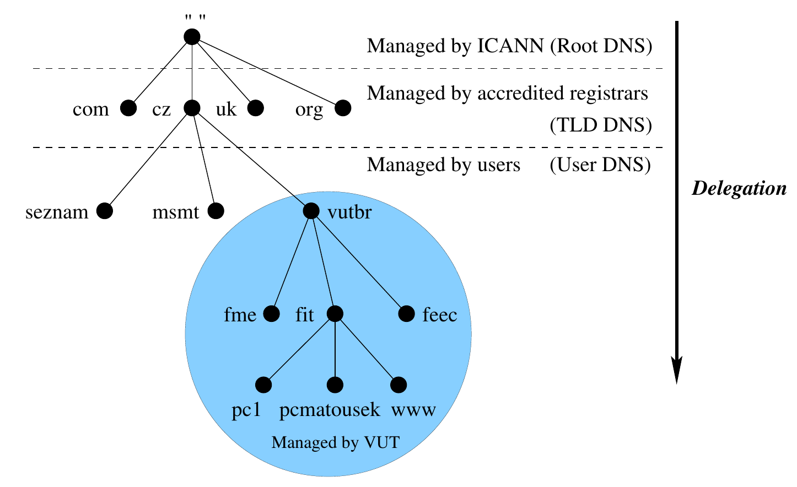
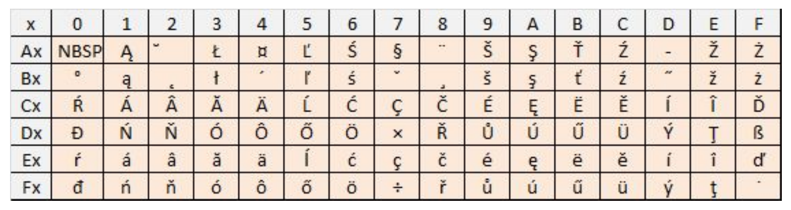
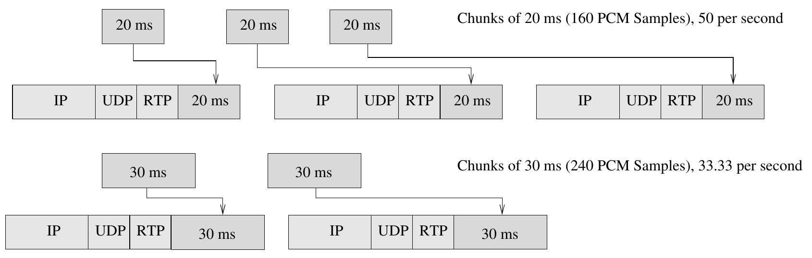
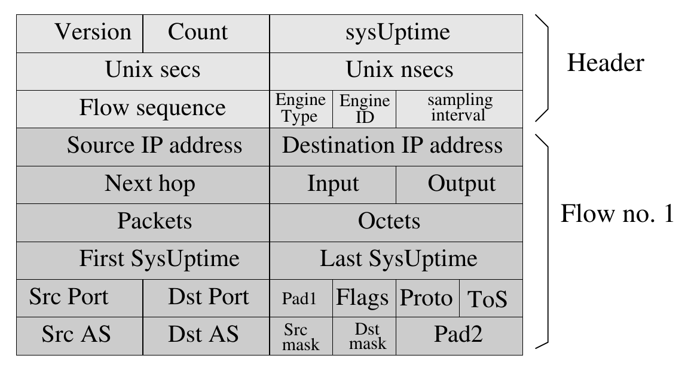

# Síťové aplikace a správa sítí (ISA)

[toc]

---

## Architektura sítí, adresování, testování (přednáška 1)

### Modely ISO OSI a TCP/IP

- Vrstva modelu definuje obecné funkce poskytované vyšším vrstvám
- Funkce dané vrstvy jsou implementovány příslušnými protokoly dané vrstvy
- Pro služby vyšší vrstvy je činnost nižších vrstev transparentní


- Fyzická, spojová, síťová, transportní, relační, prezentační, aplikační
- Fyzická + spojová = síťového rozhraní

### Komunikace na vrstvovém modelu TCP/IP

- Komunikující koncové body leží vždy na stejné vrstvě modelu
- Při komunikaci se využívá služeb nižších vrstev


- ARP – zjišťuje cílovou MAC adresu na základě cílové IP adresy
- ICMP – zprávy o chybách na síťové vrstvě, součást IP protokolu
- IGMP – správa multicastových skupin

### Adresování a směrování

- Adresa – způsob identifikace adresáta pomocí **jednoznačné informace**
- Směrování – _Kdo je příjemcem zprávy? Kterou cestou se má zpráva poslat, aby došla do cíle?_
- Každá vrstva modelu TCP/IP definuje své adresování
- Každá vrstva modelu TCP/IP zajišťuje určitou formu směrování
- Příklady směrování:
  - Směrování na vrstvě IP – dynamické směrování (RIP, OSPF)
  - Vyhledání záznamu v DNS – DNS rezoluce (od kořenového uzlu)
  - Vytváření hovoru IP telefonie – registrace IP telefonů v doméně VoIP
- Některé služby používají mapování adres mezi vrstvami:
  - Převod adres L3 a L2 (ARP)
  - Převod hostname a IP adresy (DNS)
  - Mapování aplikačního procesu na číslo portu
  - Mapování serveru VoIP na IP adresu

#### Vrstva síťového rozhraní

- 48b **fyzická adresa**, např. `00:0c:6e:77:ce:22`
  - Jednoznačně identifikuje síťové rozhraní počítače
  - Určena k adresování v lokální síti
  - Prvních 24 bitů – OUI (_Organizationally Unique Identifier_)
  - Zbylých 24 bitů – číslo síťového rozhraní přidělené výrobcem
- L2 rámec obsahuje typ protokolu (_Type_) – `0x0800` (IP), `0x86DD` (IPv6)
- Dvě verze Ethernet rámců: Ethernet II (DIX) – _Type_, IEEE 802.3 – _Length_


- L2 adresa pro broadcast – `ff:ff:ff:ff:ff:ff`
- L2 adresy pro multicast IPv4 – `01:00:5e:__:__:__`
- L2 adresy pro multicast IPv6 – `33:33:__:__:__:__`

#### Síťová vrstva

- 32b **IPv4 adresa**, např. `147.229.12.91`
- 128b **IPv6 adresa**, např. `2001:67c:1220:808::93e5:80c/64`
- IP adresa jednoznačně identifikuje síťové rozhraní počítače v síti
- Určena k adresování i mimo lokální síť
- Obsah IP datagramu určuje hodnota pole _Protocol_/_Next Header_
- IPv4 a IPv6 fungují v systému jako dva oddělené TCP/IP stacky


##### Adresování IPv4 s využitím tříd (_classful_)

- IPv4 = _netid_ + _hostid_


##### Adresování IPv4 s variabilní délkou masky (_classless_)

- Efektivnější využití prostoru IPv4 adres, vytváření podsítí (_subnetting_)
- Beztřídní směrování (CIDR, _Classless Inter-Domain Routing_)

##### Přidělování adres a konfigurace zařízení

- Manuální konfigurace v operačním systému
- Dynamická konfigurace IPv4 – protokoly BOOTP a DHCPv4
- Dynamická konfigurace IPv6:
  - Způsob přidělení konfigurace oznámí směrovač zprávou ICMPv6 RA (_Router Advertisement_)
  - Typ konfigurace se určí podle příznaků M (_Managed_) a O (_Other_) v RA
    | M | O | Typ |
    | --- | --- | -------------------------------------------------------------------- |
    | 0 | 0 | Bezstavová konfigurace SLAAC (_Stateless Address Autoconfiguration_) |
    | 0 | 1 | Bezstavová konfigurace SLAAC a DHCPv6 |
    | 1 | 0 | Stavová konfigurace DHCPv6 |

#### Transportní vrstva

- 16b **číslo portu**, např. 80
  - Jednoznačně identifikuje službu na daném počítači
  - Systémové (0–1023), uživatelské (1024–49151), dynamické (49152–65535)
- Spojované (TCP) a nespojované (UDP) služby


#### Aplikační vrstva

- Adresování je závislé na konkrétní aplikaci – formát rozsah i použití
  - Elektronická pošta – e-mailová adresa
  - Systém DNS – doménové jméno
  - WWW – URL
  - IP telefonie – URI
  - SNMP – OID
  - LDAP – DN
  - FTP – jméno souboru

### Poznámky

- Posílání mimo lokální síť – mám cílovou IP adresu, ale nelze zjistit odpovídající cílovou MAC adresu pomocí ARP → nastavím MAC adresu default gateway

## Multicast, zpracování dat na linkové vrstvě (přednáška 3)

### Multicast

- Jeden paket doručen skupině uzlů v multicastové skupině
- Jedna cílová IP adresa typu multicast (IPv4/IPv6) pro více počítačů
  - IPv4 – adresy třídy D (`224.0.0.0`–`239.255.255.255`)
  - IPv6 – prefix `0xFF00::/8`
- Zdrojová IP adresa patří zdroji multicastu
- Lokální připojování či odpojování uzlů k multicastovým skupinám:
  - IPv4 – IGMP (_Internet Group Management Protocol_), zprávy Membership Query, Membership Report, Leave Group
  - IPv6 – MLD (_Multicast Listener Discovery_), zprávy Multicast Listener Query, Multicast Listener Report, Multicast Listener Done
- Globální směrování multicastu: PIM (_Protocol Independent Multicast_), DVMRP, MOSPF
- _IGMP/MLD snooping_ – umožňuje přepínačům sledovat IGMP komunikaci a posílat data jen na porty, které mají zájem; pokud přepínač snooping nepodporuje, posílá na všechny porty

### Připojení do multicastové skupiny (operace join)

- Klient posílá zprávu IGMP Membership Report na IP adresu multicastové skupiny
- L2 přepínač předá zprávu na všechny porty nebo na vybrané porty (IGMP snooping)
- Vysílající stanice posílá multicastová data na multicastovou adresu


### Správa multicastových skupin (operace query)

- Směrovač se pravidelně zprávou IGMP Membership Query dotazuje, kdo je členem multicastové skupiny
  - General Query (`224.0.0.1`, všechny uzly), Group-Specific Query (konkrétní adresa skupiny)
- Aktivní klienti odpovídají zprávou IGMP Membership Report


### Odpojení od multicastové skupiny (operace leave)

- Klient posílá zprávu IGMP Leave Group všem směrovačům (`224.0.0.2`)
- Směrovač zprávou IGMP Membership Query zjišťuje, kdo zůstává v dané skupině
- L2 přepínač přestane posílat multicastová data na port, odkud přišla zpráva IGMP Leave Group


### Rozdělení multicastových IP adres


### Mapování multicastové IPv4 adresy na MAC adresu

- Prefix multicastové MAC adresy – `01:00:5e`
- Z IPv4 adresy se použije posledních 23 bitů
- Překrývání adres (_imperfect filtering_) – např. `224.0.1.1` a `225.0.1.1` se mapují na stejnou MAC adresu `01:05:5e:00:01:01` – přijímající aplikace zahazuje data té skupiny, do které není uzel připojen


### Mapování multicastové IPv6 adresy na MAC adresu

- Prefix multicastové MAC adresy – `33:33`
- Z IPv6 adresy se použije posledních 32 bitů
- Např. `ff02::1:ff3b:bd1c` se mapuje na `33:33:ff:3b:bd:1c`


## Zabezpečení počítačové komunikace (přednáška 4)

### Bezpečnostní rizika

- Odposlech přenášených dat
- Neautorizovaný přístup k zařízením
- Podvržení zpráv
- Falšování identity
- Útok na systém – zahlcení zdrojů
- Škodlivý software – viry, červi, trojské koně, vyděračský software

### Požadavky na bezpečnost

1. Důvěrnost (_confidentiality_) – k datům má přístup jen ten, kdo by měl
2. Autentizace (_authentication_) – ten, kdo tvrdí, že je zdrojem dat, je opravdu zdrojem
3. Integrita dat (_data integrity_) – data nejsou změněna
4. Neodmítnutelnost (_non-repudiation_) – data nemohl poslat nikdo jiný, než kdo je podepsaný
5. Dostupnost, knotrola přístupu (_access control_)

### Kryptografie

- Nauka o utajování zpráv
- Používá se pro zajištění důvěrnosti, autentizace či integrity přenášených zpráv
- Šifrování přenášených dat – ochrana vůči odposlechu
  - Pomocí symetrické kryptografie (s tajným klíčem)
  - Pomocí asymetrické kryptografie (s veřejným klíčem)
- Zajištění integrity dat – ochrana vůči úpravě dat
  - Pomocí symetrické kryptografie (kryptografický hash)
  - Používá sdílený tajný klíč pro vytvoření a ověření kryptografického hashe
- Elektronický (digitální) podpis – ochrana vůči podvržení identity
  - Pomocí asymetrické kryptografie
  - Odesilatel podepíše zprávu svým tajným klíčem
  - Příjemce ověří podpis veřejným klíčem

### Symetrické šifrování (s tajným klíčem)

- Slouží pro zajištění důvěrnosti
- Pro šifrování i dešifrování se používá stejný klíč K o délce 112–256 bitů
- Šifrování: $E_K(M) = C$, kde $E_K$ je šifrovací funkce s klíčem $K$, $M$ je vstupní zpráva
- Dešifrování: $D_K(C) = M$, kde $D_K$ je dešifrovací funkce s klíčem $K$


- Bezpečnost algoritmů spočívá v klíči, nikoliv v algoritmu šifrování
- Používá jednoduché matematické operace implementované v HW → rychlý výpočet
- Šifrují se jednotlivé bity (proudová šifra) či bloky bitů (bloková šifra)
  - Proudové šifry: DES, 3DES (OFB a CFB), RC4, SEAL
  - Blokové šifry: DES, 3DES (ECB a CBC), AES, IDEA, RC2/4/5/6, Blowfish
- Problém – distribuce klíčů (řešením je asymetrická kryptografie, Diffie-Hellman, fyzická distribuce)
- Problém – rozšiřitelnost (jiný klíč pro každou komunikující dvojici)

### Asymetrické šifrování (s veřejným klíčem)

- Slouží pro zajištění důvěrnosti a autentizaci
- Příjemce vygeneruje dva klíče – veřejný $KB_{pub}$ pro šifrování, soukromý $KB_{sec}$ pro dešifrování
- Soukromý klíč se nedá odvodit z veřejného
- Doporučená délka klíče je 2048–4096 bitů
- Šifrování: $E_{KB_{pub}}(M) = C$ (může provést kdokoliv veřejným klíčem příjemce)
- Dešifrování: $D_{KB_{sec}}(C) = M$ (může provést pouze vlastník soukromého klíče)


- Algoritmy: RSA, DSA, ELGamal, eliptické křivky (ECC), Diffie-Hellman (DH)
- Snadná rozšiřitelnost – veřejný klíč lze vystavit a sdílet
- Náročné na výpočet – dlouhý klíč, složitější výpočet
- Problém – ověření pravosti veřejného klíče – vyžaduje důvěryhodnou třetí stranu

### Zajištění integrity dat (kryptografický hash)

- Ověření integrity zprávy pomocí tajného klíče (symetrická kryptografie)
- Využívá **kryptografickou hašovací funkci** $H(M)$, např. MD4/5/6, SHA-1/2/3
- Mechanismus HMAC (_Hash-based Message Authentication Code_) přidává **tajný klíč** $S$: $H(M + S)$
- Hash bez tajného klíče → kdokoliv může změnit zprávu a připojit nový hash



- Algoritmy: HMAC-MD4, HMAC-MD5, HMAC-SHA-1, HMAC-SHA-2
- Problém – distribuce klíčů

### Elektronický podpis (_digital signature_)

- Ověření odesilatele pomocí soukromého klíče (asymetrická kryptografie)
- Elektronický podpis = **zašifrovaný hash**
- Odesilatel A vygeneruje dvojici klíčů $KA_{sec}$ (soukromý klíč) a $KA_{pub}$ (veřejný klíč)
- Podepsání: $E_{KA_{sec}}(MD) = DS$, kde $E$ je šifrovací funkce, $MD$ (_Message Digest_) je hash dokumentu a $DS$ je elektronický podpis
- Ověření: příjemce vypočítá hash dokumentu $MD'$ a porovná s $E_{KA_{pub}}(DS) = MD$


### Public key infrastructure (PKI)

- Systém certifikačních autorit pro správu, uložení a ověření veřejných klíčů
- CA ověřuje identitu uživatelů či aplikací a vytváří vazbu s veřejným klíčem → certifikát
- CA generuje, podepisuje, ukládá a ověřuje certifikáty k veřejným klíčům

### Digitální certifikát

- **Dokument ověřující pravost veřejného klíče** a příslušnost k danému uživateli
- Standard X.509
- Certifikát vydává a ověřuje certifikační autorita
- Pro ověření podpisu CA se používá certifikát kořenové CA
- K ověření slouží protokol OCSP (_Online Certificate Status Protocol_)

#### Využití digitálních certifikátů

- Bezpečný transport SSL/TLS
- Zabezpečení IP komunikace pomocí IPsec
- Šifrovaný webový provoz HTTPS
- Zabezpečení elektronické pošty S/MIME
- Autentizace uživatelů pomocí 802.1x

### Algoritmus Diffie-Hellman (DH)

- Asymetrický algoritmus pro vytvoření tajného klíče přes nezabezpečený komunikační kanál
- Algoritmus založen na umocňování čísel, kde $(A^B)^C = (A^C)^B$
- Používá se u IPsec, SSL/TLS, SSH
- Nevyžaduje šifrování
- Princip výpočtu: $(z^b\ \text{mod}\ m)^a\ \text{mod}\ m = (z^a\ \text{mod}\ m)^b\ \text{mod}\ m$
  - $a$ a $b$ jsou tajné hodnoty (strana A a B), základ $z$ a modulus $m$ jsou veřejné informace
- Příklad výměny klíčů pomocí DH:
  

### Transport Layer Security (TLS)

- Protokol TLS komunikuje nad transportní vrstvou TCP
- Zabezpečuje přenos dat protokolů aplikační vrstvy
- Zajišťuje důvěrnost, integritu dat a autentizaci (serveru, případně i klienta)


#### Vytvoření spojení TLS (_TLS handshake_)

- Strany se musí dohodnout na verzi protokolu, šifrování, autentizaci a výměně klíčů
- Autentizace může být jednostranná (pouze server) či oboustranná
- Pro výměnu klíčů se používá asymetrická kryptografie – RSA či Diffie-Hellman
- Pro šifrování se používá symetrická kryptografie
- IANA definuje sady algoritmů pro zabezpečení (_TLS Cipher Suites_)


TODO: IPsec, PGP

## Systém DNS (přednáška 5)

### Domain Name System (DNS)

- Globální adresář doménových jmen a dalších identifikátorů síťových zařízení a služeb

#### Architektura DNS

1. Globální jmenný prostor doménových jmen či adres (_DNS names_, _hostnames_) + mapování doménových jmen (nejen) na IP adresy
2. Uložení jmenného prostoru DNS + decentralizovaná správa tohoto prostoru
3. Vyhledání dat v globálním prostoru doménových jmen + přístup k datům

#### Implementace DNS

1. Hierarchické rozdělení globálního prostoru doménových adres – delegace správy
2. Záznamy v zónách DNS uložené na serverech DNS – primární a sekundární
3. Protokol DNS pro přístup k datům – vyhledávání (rezoluce), přenos zón

### Prostor doménových jmen

- Hierarchické uspořádání záznamů z prostoru DNS adres – **invertovaný strom**
- Kořen stromu – prázdný řetězec (`""`)
- Doménové jméno – cesta v grafu (např. `pc1.fit.vutbr.cz.`)
- Doména – podstrom
- Zóna – část podstromu uložená v zónovém souboru
  - Zóna nemůže obsahovat více domén (zóna ≤ doména)



- Existuje speciální doména `in-addr.arpa` tvořící tzv. **reverzní strom**


### Registrace IP adres

- Regionální registrátoři (RIR), např. RIPE NCC
  
- Lokální registrátoři (LIR), např. ISP
- _Kdo vlastní IP adresu?_ `whois`, [http://www.arin.net](http://www.arin.net)

### Servery DNS (doménové servery)

- Prostor doménových jmen je fyzicky uložen na doménových serverech
- Servery DNS obsahují informace o stromové struktuře i datech (záznamy DNS)
- Každý server spravuje jen část prostoru doménových jmen – tzv. zónu

#### Primární server (_master_, _primary name server_)

- Obsahuje úplné (autoritativní) záznamy o doménách, které spravuje
- Pro každou doménu je pouze jeden primární name server

#### Sekundární server (_slave_, _secondary name server_)

- Uchovává autoritativní kopie dat od primárních serverů (přenos zón)

#### Záložní server (_caching-only name server_)

- Pouze přijímá dotazy, které předává dalším serverům DNS
- Ukládá odpovědi do vyrovnávací paměti
- Poskytuje neautoritativní odpovědi (neúplné a neaktuální)

### Protokol DNS

- Aplikační protokol nad UDP (zřídka TCP), port 53
- Struktura zprávy DNS: _Header_, _Question_, _Answer_, _Authority_, _Additional_
  

### Komunikace v DNS


#### Rezoluce

- Vyhledání záznamu v DNS
- Komunikace typu klient-server
- Dotazy klienta vyřizuje systémová rutina OS – **resolver**
- Rezoluce začíná od kořenových serverů (13) – speciální zóna `hint` a soubor `named.root`
- Rekurzivní dotaz – pokud server nezná odpověď, přepošle dotaz dalším serverům
- Iterativní dotaz – server vrátí nejlepší možnou odpověď
  - Pokud odpověď nezná, pošle odkaz na server, který ji znát může
  - Zpravidla kořenové servery a servery TLD

#### Přenos zón

- Sekundární server zahajuje komunikaci (_polling_)
- Závisí na intervalu aktualizace (_refresh interval_) v SOA
- Celkový přenos zón (AFXR)/přírůstkový přenos zón (IFXR)
- _DNS Notify_ – upozornění o změně zóny (master → slave)

### Typy záznamů DNS

- Struktura záznamů: `[owner] [ttl] class type rdata`
- `class` je vždy `IN` – _Internet_
- Cca 90 typů záznamů definovaných IANA
- IP adresy jsou obsaženy pouze v A a AAAA záznamech

#### SOA – základní informace o zóně

- SOA – _Start of Authority_
- Každá zóna má **právě jeden** SOA
- Obsahuje název primárního serveru a e-mailovou adresu správce
- Sériové číslo `serial` identifikuje změnu záznamu
- `Refresh` – interval pro zjišťování změny (na sekundárním serveru)
- `Retry` – doba, po které se sekundární server pokusí – v případě neúspěšného přenosu – aktualizovat zónu
- `Expire` – doba platnosti dat na sekundárním serveru
- `Minimum` – implicitní doba TTL záznamů v zónovém souboru dané zóny
- Příklad:
  ```
  fit.vutbr.cz. 14386 IN SOA guta.fit.vutbr.cz.   ; primary DNS server
                             michal.fit.vutbr.cz. ; email to the responsible
                             (202410142           ; Serial number
                             10800                ; Refresh - 3 hodiny
                             3600                 ; Retry - 1 hodina
                             691200               ; Expire - 8 dní
                             86400)               ; Minimum - 1 den
  ```

#### NS – adresy autoritativních serverů

- NS – _Name Server_
- Určuje autoritativní server(y) pro danou zónu (primární a sekundární)
- Slouží k budování hierarchické struktury systému DNS
- Autoritativní servery pro TLD jsou uvedeny v seznamu `root.zone` na IANA
- Příklad:
  ```
  fit.vutbr.cz.    7012    IN    NS    gate.feec.vutbr.cz.
  fit.vutbr.cz.    7012    IN    NS    kazi.fit.vutbr.cz.
  fit.vutbr.cz.    7012    IN    NS    guta.fit.vutbr.cz.
  fit.vutbr.cz.    7012    IN    NS    rhino.cis.vutbr.cz.
  ```
- Který server je primární lze zjistit pouze z SOA

#### A a AAAA – převod doménové adresy na IP

- A – _Address_, IPv4
- AAAA – IPv6
- Resolver často posílá při přímém překladu dva dotazy na A i AAAA
- Většina operačních systémů dnes preferuje odpověď AAAA
- Příklad:
  ```
  isa.fit.vutbr.cz.    14347    IN    A       147.229.176.18
  www.cesnet.cz.       3600     IN    AAAA    2001:718:ff05:108::93
  ```

#### MX – adresy poštovních serverů

- MX – _Mail Exchanger_
- Slouží pro správné doručení elektronické pošty
- Přesměruje poštu pro danou doménu na konkrétní poštovní server
- Zóna může obsahovat více MX záznamů na poštovní servery s různou prioritou
- Příklad:
  ```
  stud.fit.vutbr.cz.    10384    IN    MX    10 eva.fit.vutbr.cz.
  stud.fit.vutbr.cz.    10384    IN    MX    20 kazi.fit.vutbr.cz.
  ```
- `10` a `20` jsou priority

#### CNAME – aliasy počítačů

- CNAME – _Canonical Name_
- Mapuje alias zařízení na kanonické (primární) jméno počítače
- Síťové zařízení může mít více aliasů
- Alias nesmí ukazovat na jiný alias
- Příklad:
  ```
  www.strathmore.    12051    IN    CNAME    strathmore.edu.
  strathmore.edu.    12051    IN    A        34.243.183.166
  ```

#### PTR – reverzní mapování adres

- PTR - _Domain Name Pointer_
- Mapuje IPv4 a IPv6 adresu na doménovou adresu
- Obsahuje reverzní (zpětné) mapování
- Využívá speciální podstromy `in-addr.arpa.` a `ipv6.arpa.`
- Příklad:
  ```
  23.9.229.147.in-addr.arpa.    14400    IN    PTR    www.fit.vutbr.cz.
  7.1.9.0.5.e.3.9.0.0.0.0.0.0.0.0.9.0.8.0.0.2.2.1.c.7.6.0.1.0.0.2.ip6.arpa.    14400    IN
      PTR     www.fit.vutbr.cz.
  ```

#### SRV – adresování služeb

- SRV – _Service Record_
- Lokalizace služeb a serverů, např. SIP, XMPP a dalších služeb
- Slouží také k distribuci zátěže či zálohování služeb
- `_Service._Proto.Name TTL Class SRV Priority Weight Port Target`
- Příklad:
  ```
  _sip._udp.cesnet.cz.    1706    IN    SRV    100 10 5060 cyrus.cesnet.cz.
  _ldap._tcp.vutbr.cz.    300     IN    SRV    0 100 389 dc3.vutbr.cz.
  _ldap._tcp.vutbr.cz.    300     IN    SRV    0 100 389 dc2.vutcz.cz.
  _ldap._tcp.vutbr.cz.    300     IN    SRV    0 100 389 dc1.vutcz.cz.
  _ldap._tcp.vutbr.cz.    300     IN    SRV    0 100 389 dc4.vutbr.cz.
  ```

### Zabezpečení systému DNS

- Veřejná služba, distribuovaný systém, nezbytné pro komunikaci na internetu

#### Požadavky na bezpečnost

- Integrita dat
- Autentizace zdroje dat
- Zajištění soukromí uživatele

#### Bezpečnostní rizika

- Podvržená data v paměti DNS cache (_cache poisoning_)
  - Vložení nesprávné informace do vyrovnávací paměti serveru DNS
  - Zneužití sekce `Additional` v odpovědi
- Odepření služby (_Denial of Service_, _DoS_)
  - Přetížení služby útokem DoS nebo DDoS
  - Blokování služby pro legitimní odpovědi

### DNSSEC

- _DNS Security Extension_
- Zajištění integrity dat a autentizace
- Podepisování záznamů DNS v zónách pomocí ZSK (_Zone Signing Key_)
- Podepisování klíčů pro podepsání záznamů pomocí KSK (_Key Signing Key_)
- Záznam DNSKEY – veřejný klíč pro ověření podpisů
- Záznam RRSIG – podpis daného záznamu<!-- - Záznam NSEC, NSEC3 – odkaz na další záznam při dotazu na neexistující doménu -->
- Záznam DS – pro ověření záznamu DNSKEY, uložený v nadřazené doméně


### Šifrování DNS

- DNS over TLS (DoT)
- DNS over HTTPS (DoH)

## Poštovní a adresářové služby (přednáška 6)

### Poštovní služby

#### Funkce

- Adresování a směrování e-mailů – e-mailové adresy, DNS záznamy MX
- Formát přenášených zpráv, protokol pro přenos elektronické pošty
- Přístup k e-mailovým schránkám
- Vyhledávání adresátů

#### Architektura

- Poštovní klient (MUA, _Message User Agent_) – formátování zprávy do protokolu a přenos na server
- Poštovní server (MTA, _Message Transfer Agent_) – příjem zpráv, předávání zpráv, uložení do lokální schránky, autentizace uživatele
- Komunikační protokoly: SMTP, POP3, IMAP, HTTP (Webmail)


### Formát zpráv

- Původně 7bitový ASCII
- Rozšíření MIME (_Multipurpose Internet Mail Extension_) – netextová data, přílohy
- Tři části zprávy: obálka (vytváří MTA), hlavička a tělo (vytváří MUA)
  

### Kódování zpráv

- 7bitové ASCII je nevhodné na posílání národních znaků nebo binárních dat – je nutné překódování

#### Quoted-printable

- Každý byte je zakódován trojicí ASCII znaků – `=` + hexadecimální hodnota kódovaného bytu
- Např. `m=F9=BEe=B9` → `m =F9 =BE e =B9` → „můžeš“



#### Base64

- Každé 3 byty se převedou na 4 šestibitové znaky, do trojic se doplní znaky `=`


#### Multipurpose Internet Mail Extensions (MIME)

- Popisuje strukturu e-mailové zprávy s více formáty obsahu
- Přidává do zprávy vlastní hlavičky

```
Received: by 10.202.213.8 with HTTP; Sun, 2 Oct 2016 04:13:44 -0700 (PDT)
From: Ondrej Lichtner <ilichtner@fit.vutbr.cz>
Date: Sun, 2 Oct 2016 13:13:44 +0200
Message-ID: <CALg8J2DPNwdZZRx16BjiXNkBo0aaqYwSHQ_fa4uRYkfg1ESawQ@mail.gmail.com>
Subject: ISA prve cvicenie
To: =?UTF-8?B?TGlib3IgUG9sxI3DoWs=?= <ipolcak@fit.vutbr.cz>,
Content-Type: multipart/mixed; boundary=001a113cdcccb6b6ec053ddfebf6
Content-Length: 242124

--001a113cdcccb6b6ec053ddfebf6
Content-Type: text/plain; charset=UTF-8

Ahoj,
materialy k prvemu cviceniu som vcera pripravil do O205,
spolu s prezenckou od Libora. Zaroven som pdf, aj zdrojovy
.tex subor nahral na nesdata do "/data/data/Vyuka/ISA/Cviceni/2016/cv1"
-Ondrej

--001a113cdcccb6b6ec053ddfebf6
Content-Type: application/pdf; name="lab1.pdf"
Content-Disposition: attachment; filename="lab1.pdf"
Content-Transfer-Encoding: base64
X-Attachment-Id: f_itsj1u6z0

JVBERi0xLjUKJdDUxdgKMyAwIG9iago8PAovTGVuZ3RoIDE4MTEgICAgICAKL0ZpbHRlciAvRmxh
dGVEZWNvZGUKPj4Kc3RyZWFtCnjavVhbj9s2Fn6fX6G3lYAxh3dKedqkbdAsCiSLTIvFNn3Q2JqO
xrLsypI39q/vIQ9pSxpOZtsGhQFLPCIPD79z+6Q3t1c3b5lOmCGcKZnc3iecckJNYqQgjJnkdpX8
nH7MGFXpJ8pFJpS0N7TPfrn9V8IUUcokjBiT49R/OLkkvMiTxUi+zbhOD/bPqZFCpFW2EJSn5a6p
```

### Posílání zpráv

- _Simple Mail Transfer Protocol_ (SMTP), _Extended SMTP_ (ESMTP)
- Aplikační protokol nad TCP pro posílání elektronické pošty, port 25
- Definuje formát příkazů a odpovědí, způsob přenosu


- Logování na serveru SMTP:

  ```
  Feb 18 03:25:06 isa sendmail[8041]: gethostbyaddr(10.10.9.1) failed: 1
  Feb 18 03:25:06 isa sm-mta[8038]: u1I2P6dZ008038: from=<root@isa.fit.vutbr.cz>,
  size=1858, class=0, nrcpts=1,msgid=<201602180225.u1I2P65l008017@isa.fit.vutbr.cz>,
  proto=ESMTP, aemon=Daemon0, relay=localhost [127.0.0.1]

  Feb 18 03:25:06 isa sendmail[8017]: u1I2P65l008017: to=root, ctladdr=root (0/0),
  delay=00:00:00, xdelay=00:00:00, mailer=relay, pri=31530, relay=[127.0.0.1]
  [127.0.0.1], dsn=2.0.0, stat=Sent (u1I2P6dZ008038 Message accepted for delivery)

  Feb 18 03:25:06 isa sm-mta[8072]: STARTTLS=client, relay=kazi.fit.vutbr.cz.,
  version=TLSv1.2, verify=FAIL, cipher=DHE-RSA-AES256-GCM-SHA384, bits=256/256

  Feb 18 03:25:06 isa sm-mta[8072]: u1I2P6dZ008038: to=<root@isa.fit.vutbr.cz>,
  delay=00:00:00, xdelay=00:00:00, mailer=relay, pri=31858, relay=kazi.fit.vutbr.cz.
  [147.229.8.12], dsn=2.0.0, stat=Sent (u1I2P6UA076512 Message accepted for delivery)

  Feb 18 03:25:27 isa sm-mta[8086]: u1I2PRaV008086: from=<root@isa.fit.vutbr.cz>,
  size=2925, class=0, nrcpts=1, msgid=<201602180225.u1I2PRwa008084@isa.fit.vutbr.cz>,
  proto=ESMTP, daemon=Daemon0, relay=localhost [127.0.0.1]
  ```

### Čtení zpráv

- _Post Office Protocol_ (POP3)
  - Pouze jeden klient může přistupovat ke schránce INBOX
  - Obsah přenesen ke klientovi a aktualizován až po ukončení práce
  - Více schránek lze spravovat pouze lokálně u klienta
- _Internet Message Access Protocol_ (IMAP)
  - Vícenásobný přístup ke schránkám
  - Více schránek, práce s hlavičkami i celou zprávou
  - Atributy (_Seen_, _Answered_, _Recent_, _Deleted_, _Flagged_)

### Zabezpečení elektronické pošty

1. Přenos e-mailových zpráv mezi servery – SMTP over SSL/TLS
2. Čtení e-mailových zpráv – IMAP over SSL, HTTPS
3. Šifrování obsahu – PGP, S/MIME
4. Autentizace a integrita dat – PGP, S/MIME, DKIM
5. Ochrana proti podvržení zpráv – SPF, DKIM

#### Pretty Good Privacy (PGP)

- Zajišťuje integritu dat (MD5), autentizaci odesilatele (RSA) i šifrování (IDEA)
- Zpráva je podepsána soukromým klíčem odesilatele $KA_{sec}$
- Zpráva je zašifrována tajným klíčem $KAB_{sec}$
- Tajný klíč je zašifrován veřejným klíčem příjemce $KB_{pub}$ a připojen ke zprávě


- Odesilatel musí mít přístup k veřejnému klíči příjemce pro zašifrování zprávy
- Příjemce musí mít přístup k veřejnému klíči odesilatele pro ověření jeho identity

#### Sender Policy Framework (SPF)

- Slouží k autorizaci domény odesilatele v příkazech `MAIL FROM`, `HELO`/`EHLO` u SMTP
- Využívá záznamy TXT v DNS s prefixem `v=spf1` u domény odesilatele
  ```
  # autorizace odesilatelů z domény fit.vutbr.cz podle IP adresy či doménového jména
  fit.vutbr.cz.    869    IN    TXT    "v=spf1 a:kazi.fit.vutbr.cz a:eva.fit.vutbr.cz
                                       ip4:147.229.12.8
                                       ip6:2001:67c:1220:808::93e5:80c
                                       ip4:147.229.176.14
                                       ip6:2001:67c:1220:8b0::93e5:b00e ~all"
  ```
- Kontrolu provádí přijímající poštovní server MTA pro příchozí e-maily
- Ochrana proti podvržení e-mailových adres (_spoofing_, _phishing_, _spamming_)

#### DomainKeys Identified Mail (DKIM)

- DKIM provádí autentizaci příchozích e-mailů pomocí elektronického podpisu
- Odesílající MTA:
  - Vloží veřejný klíč do DNS záznamu TXT s prefixem `v=dkim1`
  ```
  # Formát záznamu DNS: [selector]._domainkey.[domain]
  # příslušný záznam (veřejný klı́č) v DNS, viz dig mx1._domainkey.stud.fit.vutbr.cz TXT
  # p= veřejný klı́č (public key)
  mx1._domainkey.stud.fit.vutbr.cz. 14243 IN TXT "v=DKIM1; k=rsa; p=MIGfMA0GCSqGSIb3DQEBAQUAA4GNADCBi
  QKBgQC+I2sG+wmvS6U8O/p+lC6ep0/QufQ9kwRn/cawG24yWcyU/HrUUi273j+aJYKG05ftvWmwhQ6rCsjM93f50tMljVoVupfNX
  ```
  - Podepisuje každý odesílaný e-mail soukromým klíčem, hlavička `DKIM-SIGNATURE`
  ```
  # příklad hlavičky DKIM-SIGNATURE:
  # d (sender domain), s (selector), h (signed headers), bh (hash of the e-mail body), b (signature data)
  DKIM-Signature: v=1; a=rsa-sha256; c=relaxed/relaxed; d=stud.fit.vutbr.cz; s=mx1; t=1697644105;
    bh=2Tmld2tI1HhLhYN7n1wsOqkarFoqakT4xCZDFeeuX1c=; h=Date:To:From:Subject; b=KR8OHKdTylpBm7VENjZqiXID
    /D3uISspm34QXIk+WOyMk/iV7ms0agwODjMTmHht7IPcA2BETloOMSrgI7TqTWrX/Ntkp+OkIKH8dXYvRGYok+oW+fbnuPv
  ```
- Přijímající MTA vyhledá v DNS záznam s veřejným klíčem a ten použije pro ověření podpisu v hlavičce

### Adresářové služby

- Elektronická databáze pro vyhledání uživatelů (jména, adresy, telefonní čísla,…)
- Navrženo původně jako podpora elektronické pošty
- Globální distribuovaný systém s jednotným adresováním (vychází z X.500)
- Používá se pro vyhledávání uživatelů (e-mail, IP telefonie), autentizaci a autorizaci (Web, Unix, 802.1x), ukládání údajů (Active Directory)

### Systém LDAP

- _Lightweight Directory Access Protocol_
- Aplikační protokol nad TCP, port 389
- Navržen jako zjednodušená alternativa systému X.500
- Jednodušší implementace, jeden přenosový protokol LDAP
- Využívá koncept X.500 pro uspořádání dat – _Directory Information Tree_ (DIT)


### Informační model LDAP

- **Záznam** (_entry_) = základní jednotka pro uložení informace
  - Popsán třídou objektů (_object class_) – např. `person`
  - Obsahuje seznam atributů ve tvaru `(typ, hodnota)`
  - Jednoznačný identifikátor _Distinguished Name_, DN
  <!-- - Standardizované třídy a objekty LDAP popsány v RFC 4512 -->
- Adresářové schéma obsahuje:
  - definici třídy objektů pro daný záznam (typ třídy, seznam atributů)
  - definici atributů pro danou třídu objektů (typ atributu, operace)
  - definici pravidel pro operace nad atributy (syntax, odkaz na metodu)


### Jmenný model LDAP

- Definuje organizaci a identifikaci záznamů v adresáři
- Tvoří stromovou strukturu DIT (_Directory Information Tree_)


- Záznam typu alias – alternativní jméno záznamu odkazující se na jiný záznam, např. jedna osoba patřící do více organizačních jednotek
- Odkazy typu referrals – odkaz na jiný server, speciální URL typu ldap

### Funkční model LDAP

- Protokol LDAP, komunikace typu klient-server
- Klient vytvoří zprávu (dotaz)
- Server odpoví jednou či více zprávami obsahujícími odpověď
- Data uložená ve formátu ASN 1, přenos kódován standardem BER


- Další operace nad daty:
  - Bind/Unbind – vytvoření/ukončení spojení (autentizace uživatele)
  - Compare – porovnání hodnoty atributu u zadaných záznamů
  - Abandon – zrušení předchozí operace
  - Modify – změna konkrétního záznamu
  - Add – přidání nového záznamu
  - Delete – zrušení záznamu
  - ModifyDN – změna nejlevnější komponenty v DN
- LDAP server pro danou doménu lze najít v DNS záznamech SRV

## Hlasové služby (přednáška 7)

### Klasická telefonní síť

- _Public Switched Telephone Network_ (PSTN), jednotná telefonní síť (JTS)
- Koncové zařízení (_edge device_)
- Lokální smyčka (_local loop_)
- Ústředna – _Private Branch Exchange_ (PBX), _Central Office_ (CO)
- Páteřní spoje (_trunks_)


#### Výhody

- Garantovaná šířka pásma a spolehlivý přenos (TDM)
- Dobrá kvalita přenosu u digitálních ústředen
- Napájení koncových zařízení z ústředny
- Spolehlivost, bezchybnost – dedikované spoje pro telefonní přenos
- Zavedené standardy
- Další služby (lokalizace účastníka apod.)

### IP telefonie

- Mobilita a dostupnost – přenosy nad IP sítí
- Problém napájení – PoE (_Power over Ethernet_), UPS
- Bezpečnost – autentizace, důvěrnost, zneužití
- Právní zodpovědnost – tísňová volání


- Model klient-server
- SIP klient – hardwarový telefon/softphone, převádí hlas na IP datagramy, iniciuje a přijímá hovory
- SIP server – SW aplikace, provádí registraci uživatelů, vytváří a směruje hovory

#### Signalizační protokol SIP

- _Session Initiation Protocol_
- Registrace uživatelů a zařízení
- Vytváření hovorů, směrování hovorů, ukončení hovoru
- Vytváření spojení přes server nebo typu peer-to-peer
- Nezajišťuje správu relací po jejich vytvoření, ani kvalitu přenosu
- Metody: REGISTER, INVITE, OK, BYE
- Další signalizační protokoly: H.323, Megaco/H.248, MGCP, SCCP (Skiinny), IAX

#### Transportní protokol RTP

- _Real-time Transport Protocol_
- Přenáší hlas (audio) a/nebo video přes IP
- Využívá různé kodeky pro kódování/dekódování analogového signálu
- Přímý přenos mezi koncovými zařízeními
- Používá UDP pro rychlý, ale nespolehlivý transport
- Hlavička RTP obsahuje sekvenční čísla a časová razítka pro rekonstrukci

### Kódování hlasu

- Potřebujeme převést hlas (analogový signál) na IP datagramy (digitální data)
- Digitalizace signálu:
  1. Vzorkování analogového signálu – využívá se PAM (pulzní amplitudová modulace)
  2. Kvantifikace vzorků – $\mu$-law (US, Kanada, Japonsko), $\alpha$-law (ostatní)
  3. Kódování hodnot na binární hodnoty – PCM, ADPCM, CS-ACELP
  4. Komprese (volitelně)
- Digitalizované vzorky uloženy do paketů RTP
- Šířka pásma – lidské ucho 20 Hz–20 kHz, řeč 200 Hz–9 kHz, telefonní linky 300 Hz–3,4 kHz, příp. 4 kHz
  - Pro kódování hlasu potřebujeme vzorkování minimálně 8 kHz (Nyquist-Shannon)



### Adresování a směrování SIP

- Poskytovatel VoIP přidělí uživatelům adresy SIP pro svou doménu SIP
- Adresa – SIP URI ve formátu `sip:user@domain`, např. `sip:matousp@cesnet.cz`
- Registrace uživatelů probíhá na serveru SIP poskytovatele spojení VoIP
- Registrace je nutná pro přijímání hovoru, často vyžadována i pro vytváření hovoru
- Klient SIP posílá zprávu INVITE na server SIP svého poskytovatele
- Server SIP směruje žádost INVITE do sítě serverů SIP
- Pro směrování využívá záznamy DNS (NAPTR, SRV) pro nalezení cílového serveru
- Volaný klient musí být zaregistrován, aby mohl přijmout hovor


#### Registrace uživatele – metoda REGISTER

- Uživatel identifikován SIP URI
- Registrace ukládá polohu klienta (IP adresu a port) do lokalizační databáze
- Registrace obvykle vyžaduje autentizaci uživatele heslem
- Klient SIP mapuje ID uživatele (user URI) na adresu zařízení (device URI)
- Server SIP dané domény udržuje lokalizační údaje o připojených klientech


#### Ustavení spojení – metoda INVITE

1. Volající pošle volanému zprávu INVITE přes svůj lokální server SIP
2. Pokud je volaný připravený, odpoví zprávou OK
3. Volající potvrdí přijetí zprávou ACK a začne komunikace
4. Hlasová data jsou obvykle směrována přímo mezi telefony komunikujících stran


TODO: RTP

TODO: streaming

## Prostředky pro správu sítí (přednáška 9)

### Úkoly správy sítí

- Monitorování zařízení uživatelů, správa nastavení a systémů
- Autorizace přístupu k zařízením a službám, účtování
- Sledování zatížení, plánování zdrojů, řešení výpadků a chyb
- Bezpečnostní monitorování – detekce útoků a nedovoleného chování
- Zálohování a obnova zdrojů na síti

#### Viditelnost sítě (_visibility_) pomocí sběru dat (monitorování)

- Typy monitorovacích dat
  - Monitorované objekty SNMP, záznamy NetFlow, zprávy ICMP
  - Systémové logy, zachycené pakety (hlavička, obsah)
- Způsob sběru monitorovacích dat
  1. Pasivní monitorování: syslog, asynchronní SNMP, NetFlow
  2. Aktivní monitorování: ICMP, SNMP, telnet, testování aplikací
- Obsah monitorovacích dat
  1. Sběr metadat: typy a počty přenesených paketů/toků, jejich velikost, rozložení provozu, statistiky nejvíce komunikujících uzlů, stavy linek
  2. Plný záchyt komunikace: pakety ve formátu PCAP

#### Zpracování dat (_data processing_, _filtering_, _correlation_)

- Uložení monitorovaných dat, filtrování, agregace, korelace událostí

#### Prezentace dat a odezva na události (_presentation_, _response_)

- Zobrazení událostí, statistik, detekovaných incidentů, výpadků, varování
- Rekonfigurace sítě, filtrování nebezpečné komunikace apod.

### Správa na úrovni IP

- _Internet Control Message Protocol_ (ICMP)
- ICMP je povinnou součástí implementace IP v modelu TCP/IP
- ICMP slouží k detekci chyb při doručování IP datagramů


#### Zprávy ICMP


#### Nástroje pro aktivní monitorování pomocí ICMP

- Ping – posílá zprávy ICMP Echo na cílovou adresu, vzdálený uzel odpoví zprávou ICMP Echo Reply
- Traceroute – posílá IP pakety se zvyšujícím se TTL, očekává zprávy ICMP Time Exceeded Message

#### Bezpečnostní rizika ICMP

- Prohledávání sítě pomocí zprávy ICMP Echo
- Podvržení implicitní brány – ICMP Redirect Message

#### Zprávy ICMPv6

- Zapouzdřeny v protokolu IPv6 – _Next Header_ = 58 (ICMPv6)
- Formát zprávy obsahuje pole _Type_, _Code_, _Checksum_ a _Message Body_
- Zprávy rozděleny na chybové (typ 0–127) a informační (128–255)


### Simple Network Management Protocol (SNMP)


#### Základní prvky systému SNMP

- **Monitorované objekty** (_managed objects_)
  - Definice a popis objektů pomocí jazyka SMI
  - Adresování pomocí OID (_Object Identifier_), např. `1.3.6.1.2.1.2.1`
- Uspořádání objektů do skupin a jejich decentralizovaná správa pomocí MIB
  - **Databáze objektů MIB** (_Management Information Base_)
  - Stromová struktura – objekty (listy), skupiny objektů (nelistové uzly)
  - Standardizované MIB-2 či proprietární databáze MIB
  - Různé typy zařízení využívají k monitorování různé skupiny objektů
- Získávání a zpracování monitorovaných dat
  - **Agenti SNMP**
  - **_Network Management System_** (NMS, SNPM server)
- Komunikace – protokol SNMP
  - Základní příkazy: Get, GetNext, GetBulk, Set, Trap
  - Hodnoty objektů se pro přenos kódují pomocí BER (_Basic Encoding Rules_)
  - Kódování BER využívá strukturu TLV (_type-length-value_)

#### Definice monitorovaných objektů

- Jazyk SMI (_Structure of Management Information_) definuje pravidla pro vytváření monitorovaných objektů
- Datové typy pro vytváření objektů:
  - `INTEGER`, `OCTET STRING`, `OBJECT IDENTIFIER`, `NULL`
  - `Integer32`, `IpAddress`, `Counter32`, `Gauge32`, `Unsigned32`
  - `TimeTicks`, `Opaque`, `Counter64`, `SEQUENCE OF`, `SEQUENCE`
- Popis objektu tvoří:
  - Jméno objektu – jednoznačný identifikátor OID (_Object Identifier_)
  - Syntax – abstraktní datový typ spojený s objektem
  - Kódování pro přenos po síti – používá se BER (_Basic Encoding Rules_)
- Příklad jednoduchého objektu `ipInDelivers`:
  ```
  ipInDelivers  OBJECT-TYPE        -- OID 1.3.6.1.2.1.4.9
    SYNTAX      Counter32
    MAX-ACCESS  read-only
    STATUS      current
    DESCRIPTION "The total number of input datagrams successfully
                 delivered to IP user-protocol (including ICMP)."
    ::= { ip 9 }
  ```
- Příklad složeného datového typu `SEQUENCE` pro vytvoření tabulky `ifEntry`:
  ```
  IfEntry ::= SEQUENCE {           -- OID 1.3.6.1.2.1.2.2.1
    ifIndex        INTEGER,        -- OID 1.3.6.1.2.1.2.2.1.1
    ifDescr        DisplayString,  -- OID 1.3.6.1.2.1.2.2.1.2
    ifType         INTEGER,        -- OID 1.3.6.1.2.1.2.2.1.3
    ifMtu          INTEGER,        -- OID 1.3.6.1.2.1.2.2.1.4
    ifSpeed        Gauge,          -- OID 1.3.6.1.2.1.2.2.1.5
    ifPhysAddress  PhysAddress,    -- OID 1.3.6.1.2.1.2.2.1.6
    ...
  }
  ```
  
  - Položka `ifIndex` identifikuje pořadí konkrétního síťového rozhraní, např. `ifIndex = 3`
  - Objekt `ifDescr` na řádku 2 tabulky adresován hodnotou 2, tj. `1.3.6.1.2.1.2.2.1.2.2`
  - Objekt `ifDescr` na řádku 3 tabulky adresován hodnotou 3, tj. `1.3.6.1.2.1.2.2.1.2.3`

#### Uspořádání objektů v databázi MIB

- Hierarchický strom objektů
- Internet – `1.3.6.1.2`


- Základní objekty databáze MIB-2:
  

#### Kódování objektů BER

- _Basic Encoding Rules_
- Definuje reprezentaci objektů pro přenos po síti
- Struktura TLV (_type-length-value_) pro kódování typu, délky a hodnoty objektu
  
  - _Class_: Universal (00), Application (01), Context specific (10), Private (11)
  - _P/C bit_: primitive form (0), constructed form (1)
  - _Tag_: data type based on the class
    

#### Komunikační protokol SNMP

- Aplikační protokol pro práci s monitorovanými objekty
- Nestavový protokol typu dotaz-odpověď (UDP)
- Vyzývání (_polling_, port 161), asynchronní zprávy _trap_ (port 162)
- Verze SNMPv2 a SNMPv3


#### Formát paketů SNMPv1 a SNMPv2


#### Formát paketů SNMPv3

- PDU kromě hlavičky může být poslána v otevřené podobě či zašifrována
- Autentizace – HMAC s MD5 nebo SHA-1
- Šifrování – CBC-DES, CFB-AES či 3DES
- Vyžaduje správu klíčů


## Monitorování toků NetFlow (přednáška 10)

### Monitorování počítačových sítí

#### Analýza provozu

- Sledování obsahu paketů (DPI, _Deep Packet Inspection_)
  - Rekonstrukce protokolů L3 až L7
  - Analýza dat L7 (offline či online)
  - Rekonstrukce vlastní komunikace
- Vyhledávání známých řetězců (IDS/IPS)
  - Detekce malware, nedovolené aplikace
  - Identifikace útoků DoS a DDoS
  - Filtrování komunikace

#### Vytváření dlouhodobých statistik o provozu

- Statistické údaje o provozu daného zařízení – SNMP
- Statistiky toků – NetFlow, IPFIX, sFlow, OpenFlow

### Monitorování toků

- Podobně jako u silničního provozu lze sledovat a monitorovat tok dat
- Při monitorování toků se logují metadata o každém paketu, který prošel sítí
- Záznamy o tocích se využívají pro správu síťového provozu
- V případě bezpečnostního incidentu lze identifikovat komunikaci v daném čase

#### Použití statistických dat o tocích

- Identifikace napadených počítačů – neobvyklé přenosy, neobvyklé porty, komunikace s nakaženými stroji
- Sledování úniku dat – záznamy ukazují síťovou aktivitu na lince
- Vytváření profilu
  - Analýzou dat lze zjistit běžnou pracovní dobu, čas neaktivity
  - Nevhodné aktivity, využívání sociálních sítí apod.

### Síťový tok (_flow_)

- Posloupnost paketů mající společnou vlastnost a procházející bodem pozorování za určitý časový interval
- Záznam o toku obsahuje informace o toku, typicky:
  - Zdrojová a cílová IP adresa
  - Zdrojový a cílový port
  - Typ protokolu
  - Datum a čas zaznamenání
  - Počet přenesených dat

### Architektura NetFlow

- Exportér – sonda/router pro získávání statistik o tocích, např. nprobe, Flowmon
- Komunikační protokol NetFlow, např. NetFlow v5, NetFlow v9, IPFIX, sFlow
- Kolektor – zařízení pro ukládání záznamů o tocích, např. nfdump
- Nástroje pro zobrazení dat – grafy, statistiky apod., např. NfSen


### Exportér NetFlow

- Síťové zařízení (či software), které monitoruje procházející provoz
- Vytváří záznamy o tocích (_flow records_)
- Vytváří nový nebo aktualizuje starší záznam v paměti _NetFlow cache_
- Expirace, agregace, export (UDP)

#### Export toků

- Tok považován za ukončený a vyřazen z paměti _NetFlow cache_
- Kdy dochází k exportu toku?
  - Detekce konce toku – např. TCP příznak RST/FIN
  - Neaktivita toku – neaktivní timeout (např. 15 s)
  - Příliš dlouhý tok – aktivní timeout (např. 30 min)
  - Zaplnění paměti _NetFlow cache_

### Kolektor NetFlow

- Přijímá pakety NetFlow z jednoho či více exportérů
- Zpracování záznamů o tocích, možnost agregace dat
- Uložení statistik na disk nebo do databáze
- Dotazy nad daty – skriptové zpracování, webové rozhraní, grafická prezentace

### Protokol NetFlow verze 5

- Hlavička paketu NetFlow
  - Verze protokolu, počet záznamů
  - Čas exportu, pořadí exportu
  - Identifikace sondy
- Obsah paketu
  - Množina záznamů o tocích
  - Každý záznam obsahuje statistiku o jednom toku



- Zdrojová a cílová IP adresa – pouze IPv4
- Zdrojový a cílový port
- Next hop router – pro kontrolu směrování
- Počet paketů a bytů – pro účtování
- Příznaky TCP, typ IP protokolu, ToS

### Protokol NetFlow verze 9

- Šablony – flexibilní popis struktury záznamů, možnost vlastních záznamů
- Podporuje extrakci L2 informací – např. VLAN, MPLS, multicast
- Podpora BGP, IPv6 a další


### Protokol IPFIX

- _IP Flow Information Export_
- Standardizovaná obdoba NetFlow verze 9
- Přenos jakýchkoli informací ohledně účtování, monitorování atd.
- Možnost variabilní délky políčka (např. pro řetězce)

### Vzorkování dat

- Podle pořadí, času, velikosti
- Důvod – snížení nároků na hardware (1:100 vzorkování sníží nároky cca o 75 %)
- Na exportéru i kolektoru
- Ideálně se nepoužívá

### Filtrování dat

- Klasifikace provozu na základě hodnot v hlavičkách paketů
- `nfdump` používá BPF filtr
- Filtrování předchází dalšímu zpracování
- Na exportéru i kolektoru

### Agregace dat

- Podle klíčových položek
- Ukládání nových záznamů do _aggregation cache_
- Na exportéru i kolektoru
- Příklad agregace:
  
  - Vstupní rozhraní – agregace 1+6, 2+4, 3+5
  - Typ aplikace – agregace 1+6, 2+5, 3+4
  - Autonomní systém – agregace 1+2+4+6, 3+5
  - Rozsah zdrojových IP adres – agregace např. 1+6, 2+4, 3+5
  - Rozsah cílových IP adres – agregace např. 1+2+5, 3+4, 6

## Zajištění kvality služeb (přednáška 11)

- _Quality of Service_ (QoS)

### Metody pro zajištění QoS

- Definice požadavků – _Service Level Agreement_ (SLA)
  - Popisuje požadavky na kvalitu připojení mezi zákazníkem a ISP
  - Parametry: dostupnost sítě, povolená ztrátovost, max. zpoždění, jitter apod.
- Regulace provozu – omezení rychlosti přenosu paketů
  - Ořezání provozu (_traffic policing_)
  - Rozložení provozu (_traffic shaping_)
  - Model tekoucího vědra (_leaky bucket_), model zásobníku žetonů (_token bucket_)
- Prioritizace provozu – zajistí požadovanou kvalitu přenosu
  - Značení a přednostní zpracování IP paketů ve frontách (DiffServ)
  - Rezervace přenosového pásma pro daný tok v síti (RSVP)
  - Zajištění kvality přenosu vybraných toků na síťových prvcích (IntServ)
  - Preventivní uvolňování front na síťových prvcích při zahlcení (RED, WRED)
- Kombinace regulace provozu a prioritizace provozu

### Regulace provozu

- Rozložení provozu (_traffic shaping_)
  - Řízení rychlosti a objemu provozu
  - Řeší problém shluků, lépe využívá přenosové pásmo
  - Vnáší do přenosu zpoždění
- Ořezání provozu (_traffic policing_)
  - Řízení maximální rychlosti
  - Neprovádí ukládání dat – nemá vliv na zpoždění
  - Zahazuje pakety překračující danou přenosovou rychlost


### Fronty

- Přednostní zpracování paketů ve vstupních frontách síťových zařízení


### Fronty FIFO (_First In, First Out_)

- Pakety na výstupu řazeny v pořadí, ve kterém přišly na vstup
- Je možné stanovit maximální zpoždění paketů ve frontě: $D \leq \frac{L}{R}$
- Fronta FIFO neřeší priority
- Implicitní způsob zpracování paketů na vstupním rozhraní síťového prvku


### Prioritní fronty PQ (_Priority Queues_)

- Více front s různou prioritou zpracování
- Obsahuje klasifikátor, který třídí pakety do front
- Umístění do front závisí na definované politice zpracování
- Nejprve se zpracují data ve frontě s vyšší prioritou, pak ostatní
- Rychlost obsluhy prioritní fronty – závisí na rychlosti výstupní linky
- Rychlost obsluhy neprioritní fronty – nelze určit
- Maximální zpoždění: $\infty$ (vyhladovění)


### Cyklické fronty RR (_Round-robin Queues_)

- Každý tok paketů tvoří nezávislou frontu pro zpracování
- Počet toků se dynamicky mění
- Cyklická obsluha všech front – stejný objem přenesených dat
- Rychlost obsluhy fronty: $\frac{R}{N}$
  - $N$ – počet front
- Maximální zpoždění: $\frac{LN - 1}{R}$


### Váhové fronty WFQ (_Weighted Fair Queues_)

- Pro každý tok se vytváří jedna fronta – dynamický vznik a zánik
- Váha se určuje na základě položky _IP Precedence_ (pole _ToS_ v IP hlavičce)
- Váha určuje počet odebraných paketů/bytů z fronty
- Rychlost obsluhy fronty: $W_i \cdot \frac{R}{W}$
  - $W_i$ – váha fronty $i$
  - $W$ – součet vah
- Maximální zpoždění:
  $$\frac{L}{W_1 \cdot \frac{R}{W}} + \frac{L}{W_2 \cdot \frac{R}{W}} + \dots + \frac{L - 1}{W_N \cdot \frac{R}{W}}$$


### Model tekoucího vědra (_Leaky Bucket_)

- Bez ohledu na vstupní rychlost voda vytéká konstantní rychlostí
- Pokud je vědro plné, voda se přelévá přes okraj
- Z prázdného vědra nic neteče


- Používá se pro zajištění rozložení provozu (shaping) i pro ořezání (policing)
- Mechanismus vnutí vstupnímu toku konstantní přenosovou rychlost $r$
- Vědro se implementuje jako fronta FIFO o délce $L$ s čítačem $X$
- Čítač $X$ se inkrementuje každou sekundu o hodnotu $r$: $X' := (X + r)$
  - Pokud je velikost paketu $P_i \leq X$, paket se odešle a čítač sníží: $X' := X - P_i$
  - Pokud je velikost paketu $P_i > X$, paket čeká, až čítač $X$ dosáhne hodnoty $P$
  - Pokud je $P_{new} + S > L$ (paket se nevejde do fronty), dojde k zahození
  - Po odeslání posledního paketu ve frontě se čítač X resetuje (model nemá paměť)

### Model zásobníku žetonů (_Token Bucket_)

- Zásobník žetonů obsahuje paměť pro uložení nevyužitých oprávnění k odeslání dat
- Výstupní rychlost se může krátkodobě zvýšit až do hodnoty CBS
- Model definuje:
  - průměrnou rychlost CIR (_Commited Information Rate_)
  - rychlost ve špičce PIR (_Peak Information Rate_)
  - maximální velikost shluků CBS (_Commited Burst Size_)


- Maximální délka trvání špičky: $T$
- Token rate: $r = \text{CIR}$
- Bucket size: $b = \text{CBS}$ (omezuje špičky na maximum bytů v toku za čas $T$)
- Maximální počet bytů na vstupu: $A(t) = b + t \cdot r = \text{CBS} + t \cdot \text{CIR} = \text{CBS} + t \cdot \frac{\text{CBS}}{T}$
- Maximální rychlost ve špičce: $\text{PIR} = \frac{\text{CBS}}{T} + \text{CIR}$

### Kombinace zásobníku žetonů a váhových front


### Integrované služby (IntServ)

- Implementují podporu QoS v IP síti formou rezervace síťových zdrojů
- Poskytují společnou (integrovanou) službu množině provozních požadavků

#### Třídy služeb podporovaných v IntServ

- Garantované služby (_Guaranteed Service_) – striktní omezení zpoždění ve frontách podle $(r, b)$
- Kontrolovaná zátěž (_Controlled Load_) – kvalita provozu blížící se nezatíženému prvku
- Největší úsilí (_Best Effort_) – zajištění implicitní kvality přenosu nad IP

### Resource Reservation Protocol (RSVP)

- Signalizační protokol pro rezervaci zdrojů na síťových prvcích
- Slouží k rezervaci výpočetních a přenosových zdrojů pro daný tok
- K rezervaci zdrojů dochází před vlastním přenosem (_call setup_, _call admission_)
- Žádost o rezervaci provádí přijímající stanice (_receiver-oriented_)
- Příjemce pošle směrem ke zdroji zprávu RESV s žádostí o rezervaci
- Zpráva obsahuje požadavky na kvalitu přenosu _FlowSpec_ – CIR, CBS a PIR
- Každý uzel po cestě provede požadovanou rezervaci zdrojů a předá zprávu dál
- Zdroj vysílání pošle specifikaci provozu _TSpec_ ve zprávě PATH
- Pokud se změní cesta, musí se provést nová rezervace

### Diferenciované služby (DiffServ)

- Implementují zajištění QoS v síti formou značení paketů a prioritního přeposílání
- Fáze zpracování:
  1. Klasifikace a označení paketů na hraničních prvcích domény DiffServ
  2. Prioritní přeposílání v rámci vnitřních uzlů domény DiffServ
- Snadná rozšiřitelnost a flexibilita při definici tříd zpracování


- Klasifikace provozu probíhá na hraničních prvcích dle zadaných filtrovacích pravidel
- Nastaví se políčko _IP Precedence_ (_ToS_) či _DSCP_ (_DS_) v hlavičce IP
- Na základě hodnoty _DSCP_ dojde ke zpracování paketu na aktivních prvcích

#### Základní třídy zpracování provozu PHB u DiffServ

- EF (_Expedited Forwarding_) – přednostní přeposílání s nízkým zpožděním a ztrátovostí
- AF (_Assured Forwarding_) – garantuje minimální přenosové pásmo pro každou třídu
- CS (_Class Selector_) – osm tříd CS0–CS7 (_DSCP_ ve tvaru xxx000), odpovídá _IP Precedence_
- BE (_Best Effort_) – největší úsilí, implicitní přeposílání bez implementace QoS

#### Implementace DiffServ

1. Definice požadavků na provoz
2. Rozdělení paketů dle požadavků do tříd provozu
3. Definice způsobu zpracování každé vytvořené třídy provozu (politika zpracování)
4. Namapování vytvořené politiky zpracování na síťový prvek (konfigurace)

### Prevence zahlcení RED

- _Random Early Detection_
- Náhodně zahazuje pakety ve vstupní frontě o délce L


- Pravděpodobnost zahození $P_a$ ve frontě závisí na aktuálním zaplnění fronty $Q_{avg}$:
  $$P_a = P_{max} \frac{Q_{avg} - Q_{min}}{Q_{max} - Q_{min}}$$
- Tři stavy zpracování dat ve frontě:
  - Nezahazování: $Q_{avg} < Q_{min}$
  - Náhodné zahazování: $Q_{min} \leq Q_{avg} \leq Q_{max}$
  - Úplné zahazování: $Q_{avg} = Q_{max}$

#### Váhový RED (Weighted RED)

- Rozšíření o priority u diferenciovaných služeb
- Pravděpodobnost zahození závisí na _IP Precedence_ či _DSCP_

## Synchronizace času, logování událostí (přednáška 12)

### Network Time Protocol (NTP)

- Používá se pro synchronizaci času mezi všemi zařízeními v síti
- Aplikační protokol nad UDP, port 123
- Hierarchie serverů:
  - Stratum 0 – referenční hodiny, např. atomové
  - Stratum 1 – NTP server synchronizovaný pár mikrosekund od stratum 0
  - Stratum N – NTP server synchronizovaný s NTP server stratum N-1
- Používá čtyři časové značky:
  - T1 – čas odeslání požadavku klientem
  - T2 – čas přijetí požadavku serverem
  - T3 – čas odeslání odpovědi serverem
  - T4 – čas přijetí odpovědi klientem
- Pomocí časových značek klient odhaduje zpoždění a rozdíl

### Syslog

- Protokol sloužící k logování událostí
- Aplikační protokol nad UDP, port 514
- Logy se posílají v plain textu, mohou být ukládány lokálně nebo posílány do jiné destinace
- Často používán jako jednotný logovací mechanismus pro aplikace

### Priority Syslog zpráv

| Syslog severity | Level |
| --------------- | ----- |
| Emergency       | 0     |
| Alert           | 1     |
| Critical        | 2     |
| Error           | 3     |
| Warning         | 4     |
| Notice          | 5     |
| Info            | 6     |
| Debug           | 7     |

### Formát Syslog zprávy

- _Facility_ – zdroj zprávy
- _Severity_ – číslice priority
- _Mnemonic_ – kód jednoznačně identifikující chybovou zprávu, ne vždy přítomen
- _Message-text_ – text popisující situaci


- Formát textové části závisí na aplikaci – složitá analýza a automatické zpracování

### Přenos souborů

- Konfigurace, záloha a upload firmwaru
- TFTP (_Trivial File Transfer Protocol_)
- FTP (_File Transfer Protocol_), SFTP (_SSH FTP_, _Secure FTP_) – robustnější a bezpečnější
- HTTP, REST API
